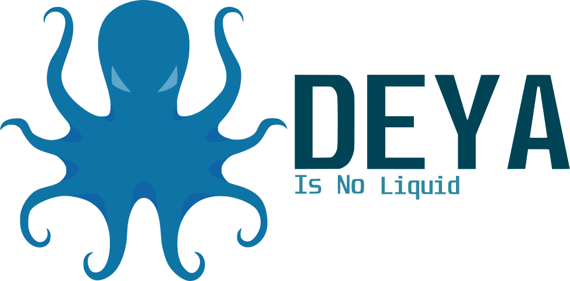

# Deya

Deya is a game engine being programmed in C++. It currently uses GLFW and OpenGL, but I am hoping to support more APIs in the future, such as Vulkan. It also currently supports both Linux and Windows (experimental), and will support other platforms such as mobile, console and macos further down the line.

## Install
**TODO: Install instructions.**

## Build from source

**Clone with:** `git clone --recursive https://github.com/FFuuZZuu/Deya`

If you previously have not cloned with `--recursive`, use `git submodule update --init` to clone the needed submodules.\
\
**TODO: Build instructions for Linux and Windows**

## How to use
**TODO: Wiki**

## The future of Deya

A lot is planned for the future of Deya, likely too large for one person. Ignoring this fact for now, here is the rough plan for Deya's future project structure:

<pre>
Deya
  ├── DeyaEngine
  │     ├── Specto (the standard renderer)
  │     ├── Praxis (the voxel renderer, using raycasting)
  │     └── Engine "agnostic" files
  │           ├── Events
  │           ├── Input
  │           ├── Window Creation
  │           └── etc...
  └── Liquid "Hub" (similar to unity hub)
        ├── Standard Level Editor (name? maybe just liquid?)
        └── Voxel Level Editor (name?)
</pre>

## Acknowledgments

Huge thanks to [The Cherno](https://www.youtube.com/channel/UCQ-W1KE9EYfdxhL6S4twUNw) for his game engine series, seeing as that is what this is based off of.

Thanks you to [Doomboom589](https://github.com/Doomboom589) for the logo he made for the game engine. You can find more of his work [here](https://www.artstation.com/doomboom589).

## Contributing
Pull requests are welcome. For major changes, please open an issue first to discuss what you would like to change.

## License
[GPLv3](https://www.gnu.org/licenses/gpl-3.0.en.html)
